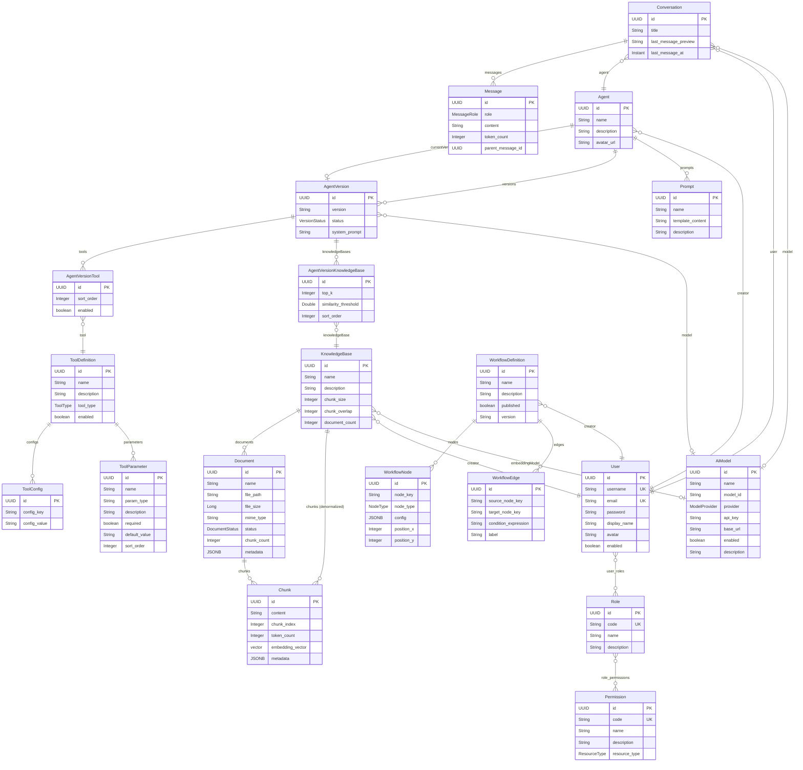

# javis-domain E-R Diagram

> 生成日期: 2026-07-21
> 实体总数: 20 个 (+ 2 个中间表)
> 所有实体继承 `BaseEntity` (id, created_at, updated_at, deleted)

## 关联关系汇总

| 关系 | 类型 | 说明 |
|------|------|------|
| User ↔ Role | ManyToMany | 中间表 `user_roles` |
| Role ↔ Permission | ManyToMany | 中间表 `role_permissions` |
| Agent → User | ManyToOne | creator |
| Agent → AgentVersion | OneToOne | currentVersion (循环 FK) |
| Agent → AgentVersion | OneToMany | versions |
| AgentVersion → Agent | ManyToOne | agent |
| AgentVersion → AiModel | ManyToOne | model |
| AgentVersionTool → AgentVersion | ManyToOne | version |
| AgentVersionTool → ToolDefinition | ManyToOne | tool |
| AgentVersionKnowledgeBase → AgentVersion | ManyToOne | version |
| AgentVersionKnowledgeBase → KnowledgeBase | ManyToOne | knowledgeBase |
| Prompt → Agent | ManyToOne | agent |
| ToolDefinition → ToolConfig | OneToMany | configs |
| ToolDefinition → ToolParameter | OneToMany | parameters |
| KnowledgeBase → User | ManyToOne | creator |
| KnowledgeBase → AiModel | ManyToOne | embeddingModel |
| Document → KnowledgeBase | ManyToOne | knowledgeBase |
| Chunk → Document | ManyToOne | document |
| Chunk → KnowledgeBase | ManyToOne | knowledgeBase (冗余) |
| Conversation → Agent | ManyToOne | agent |
| Conversation → User | ManyToOne | user |
| Conversation → AiModel | ManyToOne | model |
| Message → Conversation | ManyToOne | conversation |
| WorkflowDefinition → User | ManyToOne | creator |
| WorkflowNode → WorkflowDefinition | ManyToOne | workflow |
| WorkflowEdge → WorkflowDefinition | ManyToOne | workflow |
